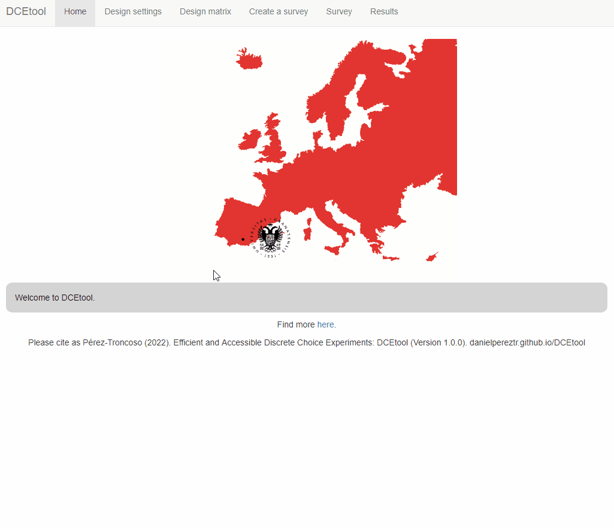
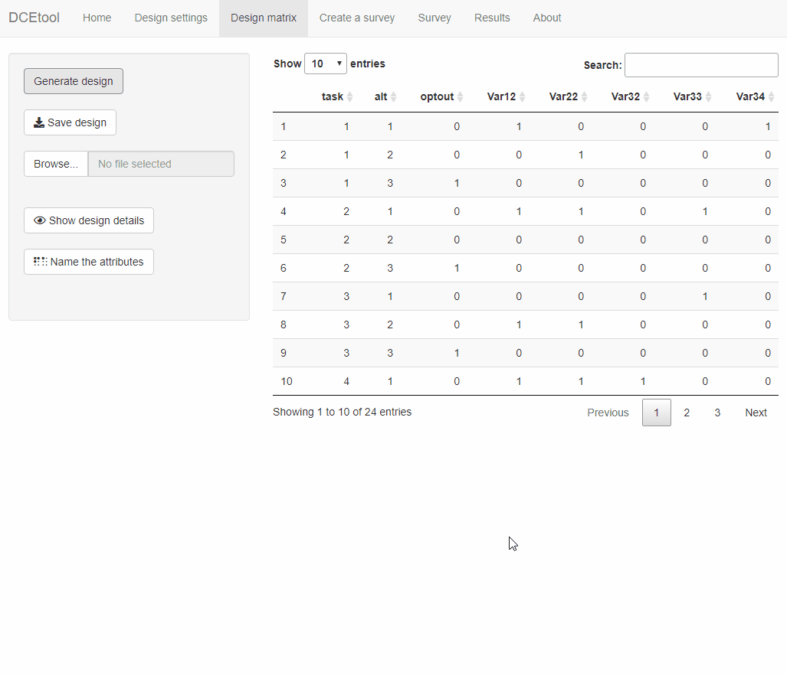
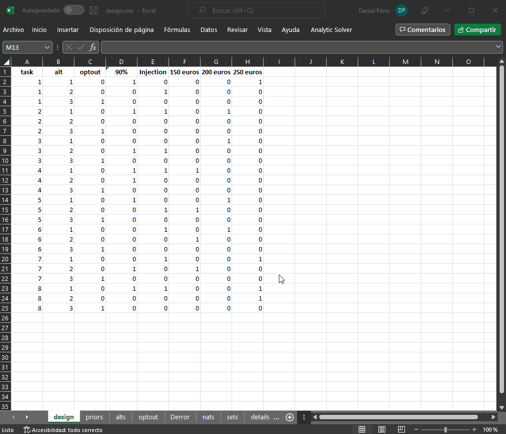
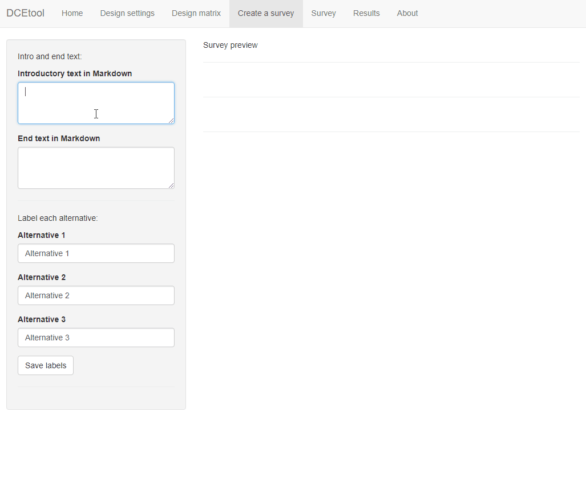
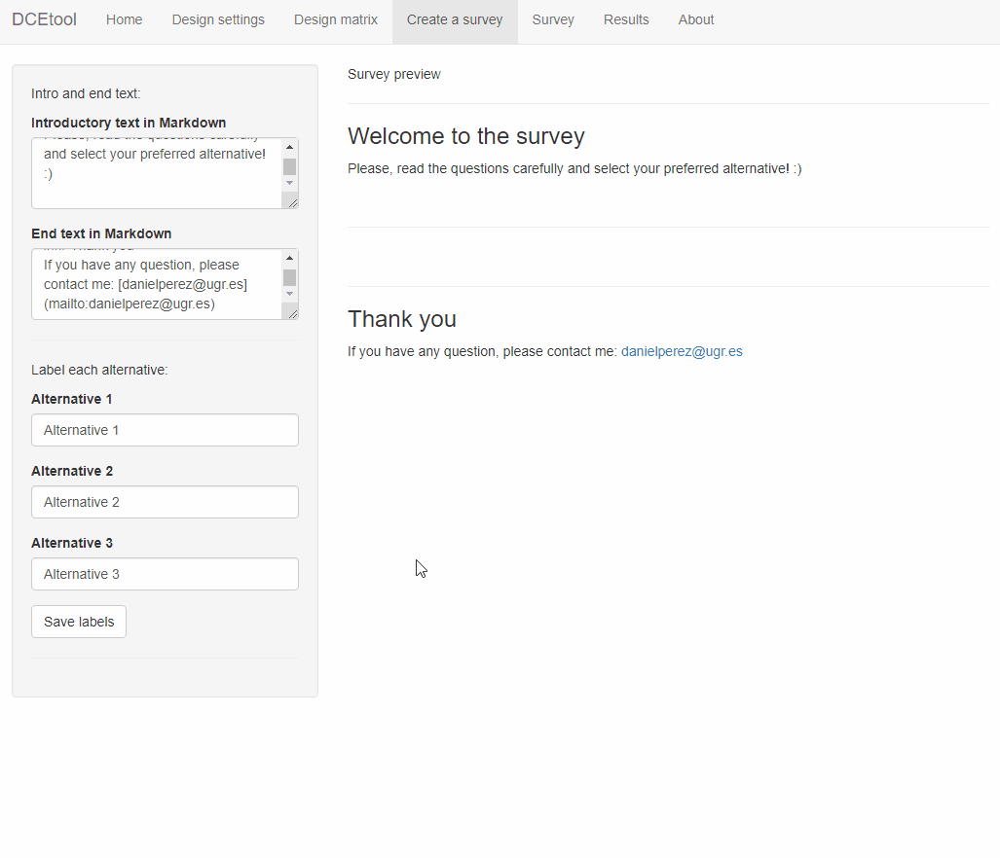
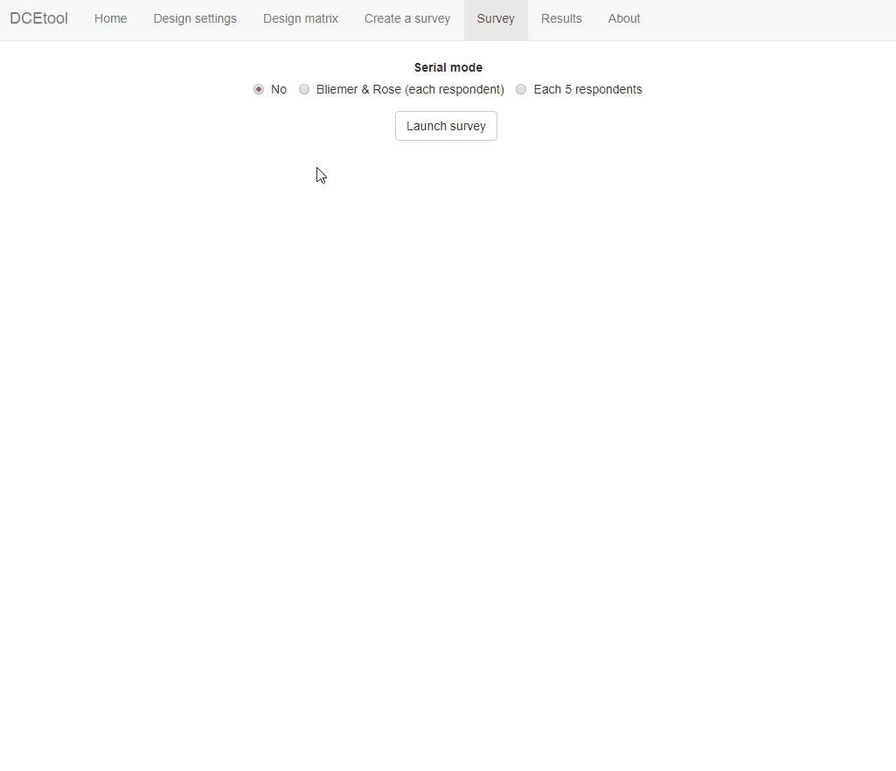
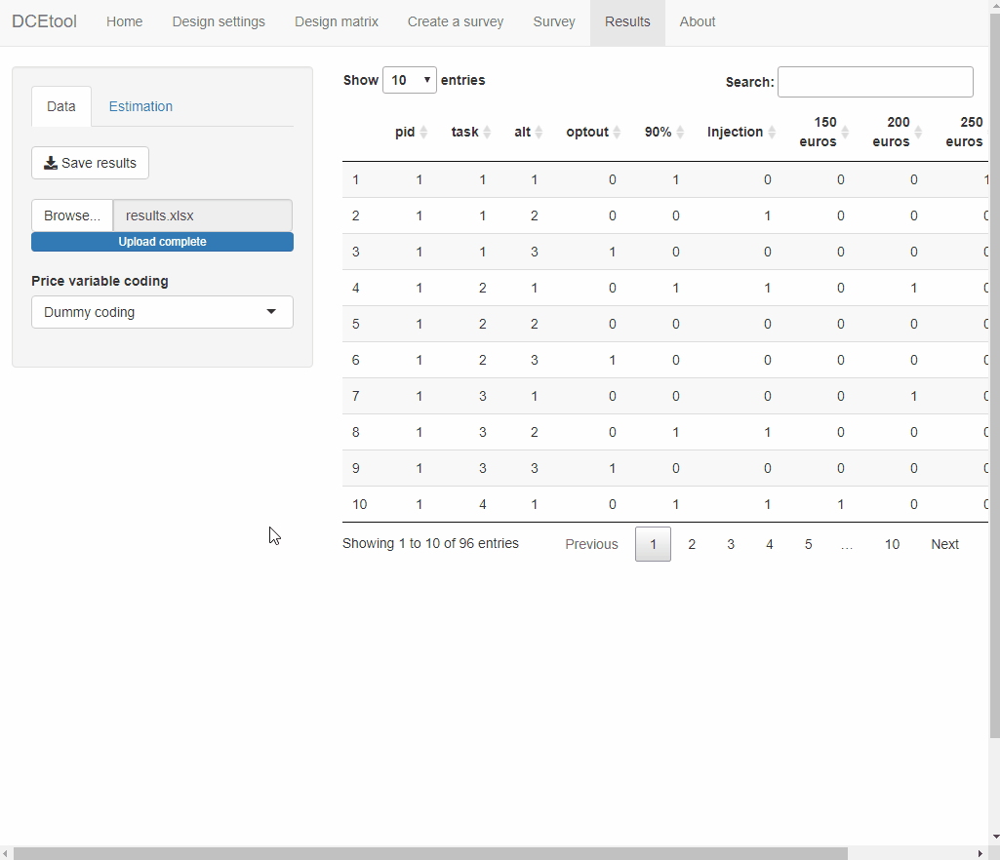
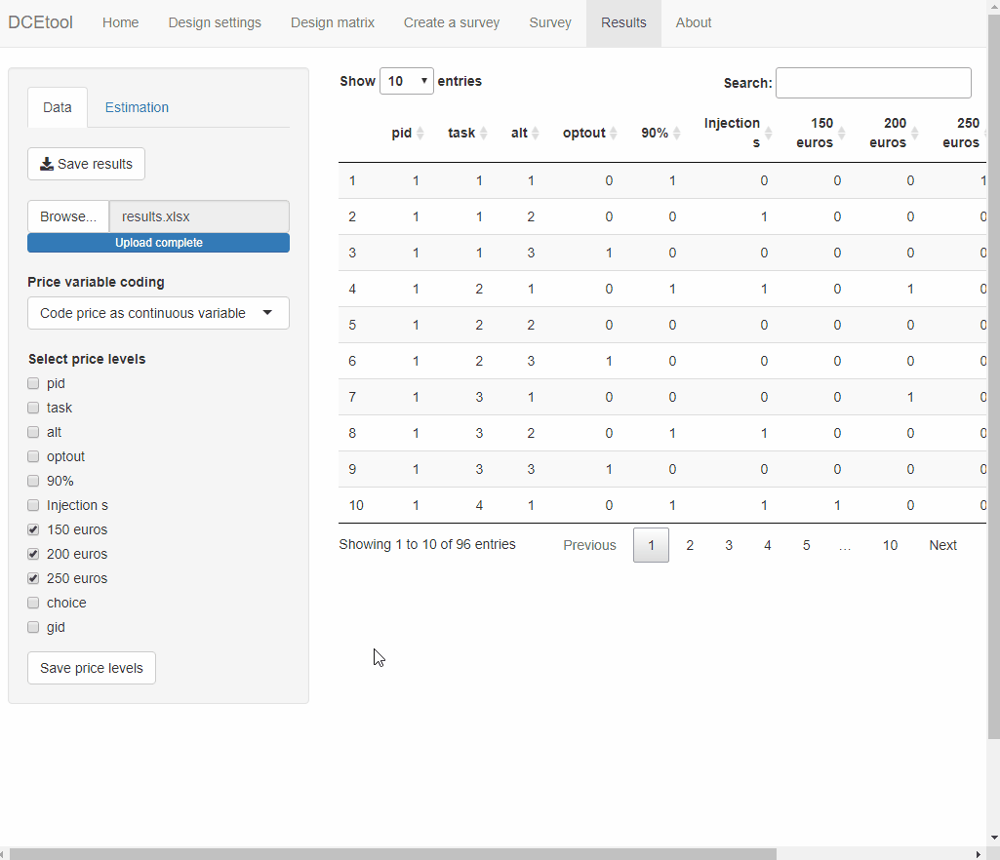
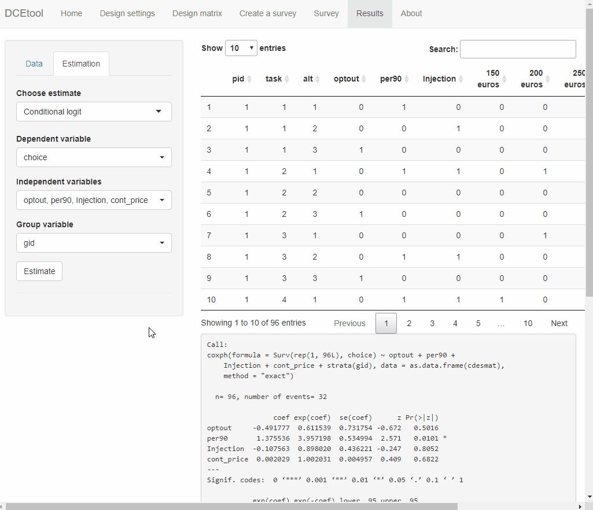
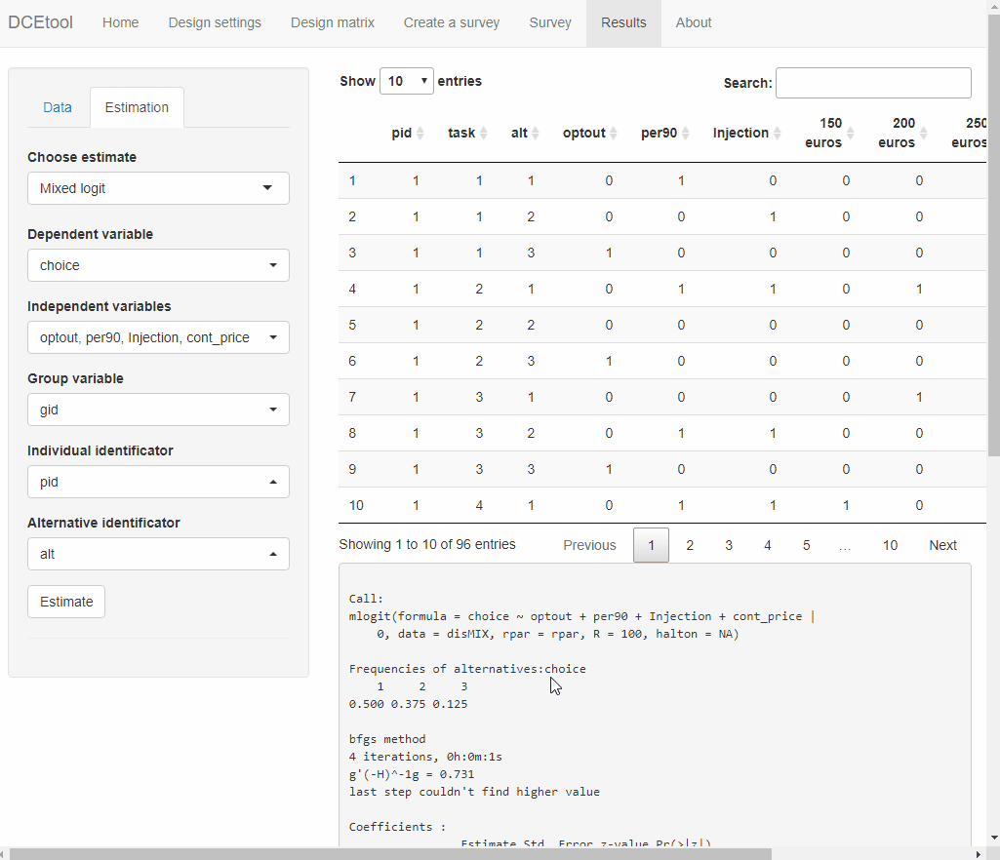

{width=50%}

### Visit the original post
Visit the original post in [https://danielpereztr.github.io/posts/DCEtool/](https://danielpereztr.github.io/posts/DCEtool/)

### What is DCEtool and how to install it
DCEtool is a R package to design, respond and analyze DCEs. DCEtool has been coded in R using the visual interface provided by the shiny package. DCEtool is available in the CRAN repository and can be easily installed typing the following code in R or RStudio. 
```R
install.packages('DCEtool')
library(DCEtool)
```
Before running the previous code, shiny must be installed and activated:
```R
install.packages('shiny')
library('shiny')
```
Once shiny and DCEtool are installed and activated, the visual interface of DCEtool can be launched running the following code: 
```R
DCEtool()
```

It can also be installed directly from GitHub: 
``` 
install.packages("devtools")
library(devtools)
install_github("danielpereztr/DCEtool")
```

### How to use it

#### Design settings
DCEtool has been design to be intuitive and easy to use. The interface is divided into seven tabs. To create a new DCE, the design characteristics must be entered in the 'Design settings' tab. First, type the number of attributes and then the number of levels in each attribute. Don't worry about the names, you will be able to change them later. 
{width=100%}
Once you click in the 'Save attributes' button, you will be asked to provide more information. Decide how many alternatives you want in each choice set. Then, decide how many choice sets will be presented to each respondent. Remember that you need at least l-k sets, where l is the total number of levels and k is the total number of attributes (+ 1 if you want an additional opt-out alternative in each choice set).

Next, you can decide whether to use the bayesian approach (learn more about it in [Sándor & Wedel (2001)](https://doi.org/10.1509%2Fjmkr.38.4.430.18904)). Then, save the inputs using the button 'Save settings'. The prior coefficients must come from a previous DCE with the same characteristics (if there is no pilot experiment, use the default vector of zeros - learn more in the introduction section of this [article](https://doi.org/10.1016/j.jocm.2022.100357)). Then, you can 'Save options' and move to the 'Design matrix' tab. 

#### Design matrix
In the 'Design matrix' tab, a table with the design matrix will be printed after clicking on the 'Generate design' button. Notice that you can save the design matrix, but it is recommended to do it after changing the names of the attributes and levels. 
{width=100%}
Click on 'Name the attributes' and give a name to each attribute in your design. Once you save the attribute names, you will be able to give a name to all levels inside one attribute. When all levels from all attributes have a name, a new button will appear under the main panel. By clicking it, you will change the column names in the design matrix. Notice that each attribute is missing one level in the columns of the design matrix to avoid multicollinearity when estimating the models. 

Next, the design can be saved as an Excel file. The Excel file can be saved to be loaded later. You can manually modify the file and DCEtool will read it correctly as long as there is consistency between all the specified parameters.
{width=100%}
You can download the design used in the example from [here][1].

#### Experimentation
DCEtool can use your design settings to reproduce a discrete choice experiment. This functionality can be used for practice, to test the performance of a given experimental design, or to conduct research with a small number of respondents. First, move to the 'Create a survey' tab and write an introductory and end text. This text will be displayed at the beginning and at the end of the survey, so it can be used to give instructions to the respondent. The text has to be written in Markdown language, learn more [here](https://www.markdownguide.org/basic-syntax/), and will be dynamically rendered to the side to check its appearance. 
{width=100%}
Then, you have to give a name to each alternative. Each time alternatives are presented, they will be labelled with the names you provide. In the main panel you will find a preview of the DCE.
{width=100%}

#### Survey
Next, you can launch a local survey. First, you will have to decide between three options: no serial approach, pure serial approach, five-by-five serial approach. The "No" option will present a usual DCE, where the same choice sets are repeated for all respondents. The "Bliemer & Rose" option will present a serial DCE as described in this [link](https://doi.org/10.1108/9781849507738-006). In short, after each response a conditional logit will be estimated whose coefficients will be used to 'tune' the next DCE to the expected responses. Finally, the 'Each 5 respondents' options will carry out the above procedure but only after 5 new responses (see the theoretical basis [here](https://doi.org/10.1016/j.jocm.2022.100357)).
{width=100%}
By clicking on 'Launch the survey', a pop-up with the survey will appear. The respondent can answer to all the questions by clicking on the radio buttons and the "Next" button. When the final text appears, the respondent can decide to end the survey or start a new survey. 

#### Results
Only when the final text is displayed, you can close the survey pop-up and move to the 'Results' tab by clicking on the 'Analyze the results' button. Moving to the 'Results' tab in the middle of the survey may cause data loss. Once in the 'Results' tab, it is highly recommended to save the results. Once the file is saved, it can be loaded at any time to redo the estimations. 

To analyze the results, first use the 'Price variable coding' menu to create a new price variable. This variable will be required to estimate the willingness to pay. Note the appearance of the variable "cont_price" in the table in the main panel. 
{width=100%}
Then, you can move to the 'Estimation' submenu to analyze the results of the discrete choice experiment. First, the a conditional logit model can be easily estimated using the first option from the drop-down menu. 
{width=100%}
The same procedure can be followed to estimate a mixed logit model. The implementation of the mixed logit in R is very unpolished, so the program can sometimes crash. If it does, simplify the variable names in the results Excel file avoiding blank spaces and special of numeric characters. 
{width=100%}
Finally, DCEtool can be used to estimate the willingness to pay for each attribute's level and make a graphical representation of the coefficients. In both cases, the last model estimated must be a conditional logit model, so first re-estimate the CLM. Then, the WTP and the graphical representation can be easily displayed. 
{width=100%}

### Found a bug? Need help? Had an idea?
Help me improve DCEtool by going to [https://github.com/danielpereztr/DCEtool](https://github.com/danielpereztr/DCEtool) and opening a new issue. 

[1]:{{ danielpereztr.github.io }}/download/design.xlsx
